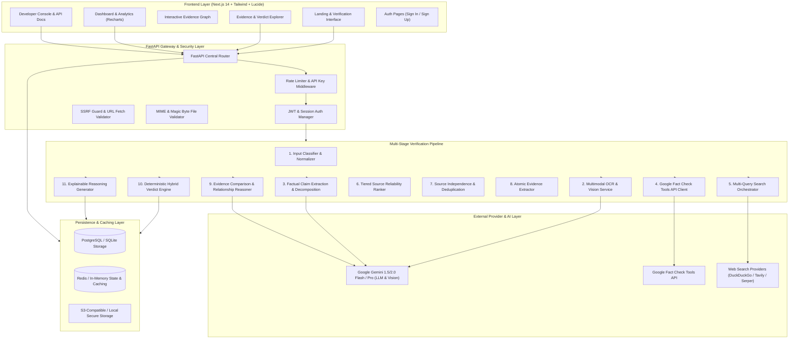
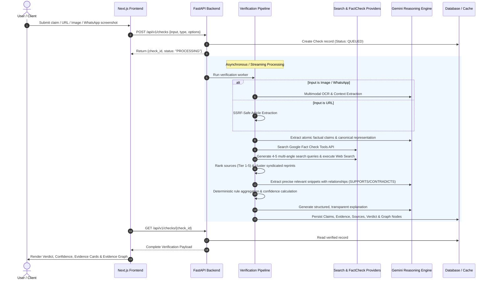
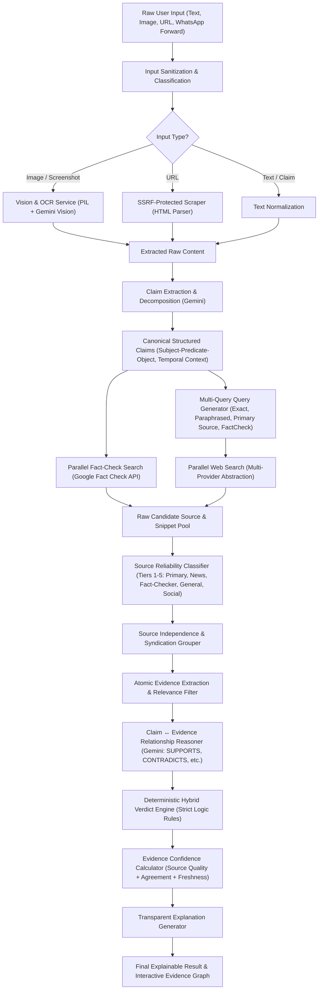
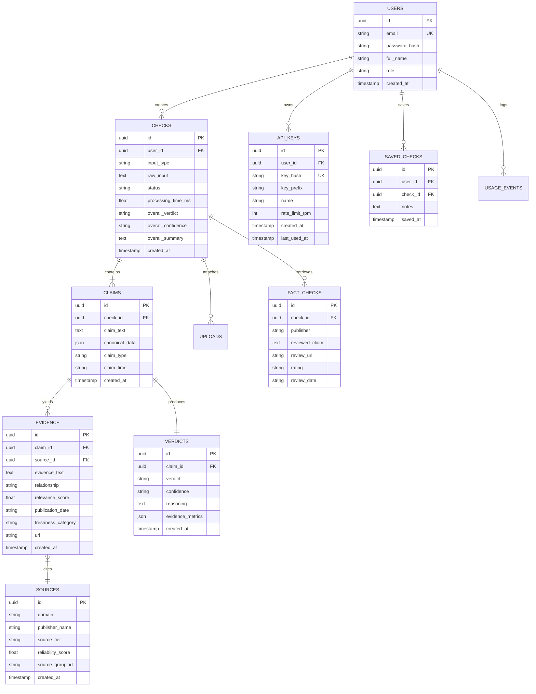
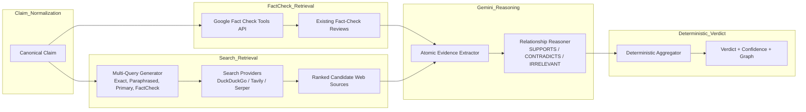
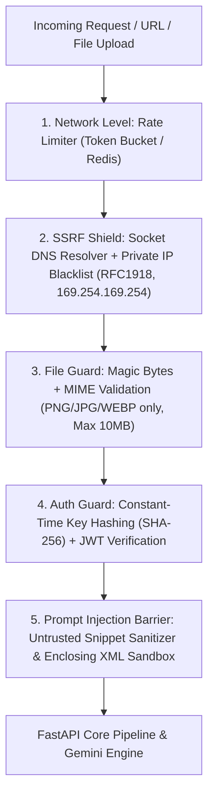
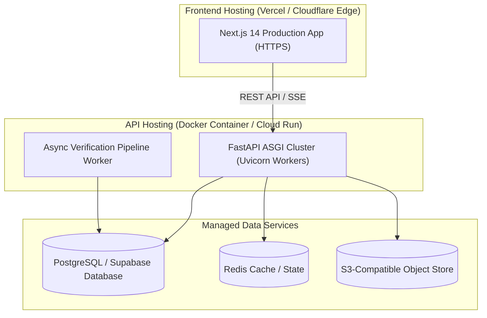

# SACHAI.AI — System Architecture & Design Specification

> **Product Principle:** *AI does not decide what is true by itself. Evidence does.*

---

## 1. System Architecture Diagram



---

## 2. End-to-End Data Flow Diagram



---

## 3. Verification Pipeline Diagram



---

## 4. Database ER Diagram



---

## 5. API Architecture and Endpoint Map

| Method | Endpoint | Description | Auth Required |
|---|---|---|---|
| `POST` | `/api/v1/auth/sign-up` | Register new user account | No |
| `POST` | `/api/v1/auth/sign-in` | Authenticate user & return JWT token | No |
| `GET` | `/api/v1/auth/me` | Fetch authenticated user profile | Yes (JWT) |
| `POST` | `/api/v1/checks` | Submit claim/URL/Image for verification | Optional |
| `GET` | `/api/v1/checks/{id}` | Retrieve real-time status & full result | No (Public or Owner) |
| `GET` | `/api/v1/checks` | Paginated check history with filters | Yes (JWT) |
| `DELETE` | `/api/v1/checks/{id}` | Delete check from history | Yes (JWT) |
| `POST` | `/api/v1/uploads` | Upload image for OCR/vision verification | Optional |
| `POST` | `/api/v1/saved` | Save / bookmark a verification result | Yes (JWT) |
| `GET` | `/api/v1/saved` | List saved verification results | Yes (JWT) |
| `GET` | `/api/v1/analytics` | Dashboard metrics & verdict breakdown | Yes (JWT) |
| `POST` | `/api/v1/api-keys` | Generate new developer API key | Yes (JWT) |
| `GET` | `/api/v1/api-keys` | List active developer API keys | Yes (JWT) |
| `DELETE` | `/api/v1/api-keys/{id}` | Revoke developer API key | Yes (JWT) |
| `POST` | `/api/v1/feedback` | Submit user feedback (👍/👎) on verdict | No |
| `GET` | `/health` | System health check (DB, AI, Search status) | No |

---

## 6. Frontend / Backend / Service Architecture

```text
c:\Users\Adarsh\Downloads\SACHAAI/
├── backend/
│   ├── app/
│   │   ├── main.py
│   │   ├── core/ (config.py, security.py, logging.py)
│   │   ├── db/ (session.py, base.py)
│   │   ├── models/ (user, check, claim, source, evidence, verdict, fact_check, api_key, saved_check, feedback)
│   │   ├── schemas/ (check, auth, api_key, feedback)
│   │   ├── providers/ (gemini_provider, search_provider, factcheck_provider)
│   │   ├── services/ (input_classifier, ocr_service, url_extractor, claim_extractor, factcheck_service, search_service, source_ranker, evidence_extractor, verdict_engine, explanation_service, pipeline)
│   │   └── api/routes/ (auth, checks, uploads, history, saved, analytics, api_keys, feedback, demo)
│   ├── evaluation/ (dataset.json, run_evaluation.py, baseline_comparison.py)
│   ├── tests/ (unit, integration, security)
│   └── requirements.txt
├── frontend/
│   ├── app/ (page, check/[id], dashboard, history, saved, developers, changelog, sign-in, sign-up, demo)
│   ├── components/ (checker, verdict, evidence, graph, dashboard, layout, ui)
│   ├── lib/ (api, auth, utils)
│   ├── types/
│   └── package.json
└── docs/ (architecture, verification-pipeline, api, security, evaluation)
```

---

## 7. AI + Web Search + Fact Check API Integration Architecture



---

## 8. Security Architecture



---

## 9. Deployment Architecture



---

## 10. Error / Fallback Architecture

| Failure Scenario | Automatic Resilient Behavior | User-Facing Result |
|---|---|---|
| **Gemini API Key Missing / 429** | Graceful fallback response informing administrator. | `AI verification service temporarily unavailable.` |
| **Search Provider Outage / Key Missing** | Immediate fallback to zero-key DuckDuckGo live search. | Real evidence retrieved seamlessly with transparent sources. |
| **Google Fact Check API Unavailable** | Seamlessly skips existing checks and executes direct multi-query web search. | `Fact-check service unavailable. Proceeding with web sources.` |
| **Insufficient Reliable Evidence** | Deterministic rule prevents speculative guessing. | `UNVERIFIED — We could not retrieve enough reliable evidence.` |
| **Paywalled / Blocked URL** | Safe SSRF scraper fails gracefully without fabricating text. | `Unable to retrieve article content. Please paste the article text.` |
| **PostgreSQL Unreachable** | Automatic fallback to local SQLite database in development mode. | Zero setup local development without crashes. |
