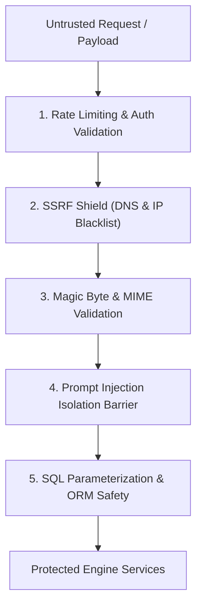

# SACHAI.AI — Security Architecture & Safeguards

---

## Defense-in-Depth Model

SACHAI.AI implements strict security controls across network boundaries, file ingestion, prompt execution, and data storage.

---

## 1. SSRF (Server-Side Request Forgery) Protection
When processing URL inputs, `validate_ssrf_safe_url` resolves DNS hostnames and verifies target IPs against RFC 1918 private subnets, loopback addresses (`127.0.0.1`, `localhost`), and cloud metadata endpoints (`169.254.169.254`, `metadata.google.internal`).

## 2. Magic-Byte File Validation
Uploaded images are inspected for authentic binary signatures before parsing:
- **PNG:** `\x89PNG\r\n\x1a\n`
- **JPEG:** `\xff\xd8\xff`
- **WEBP:** `RIFF....WEBP`
Files that disguise executable binaries or PHP scripts under `.png` extensions are rejected immediately with HTTP 400.

## 3. Prompt Injection Defense
All external web snippets and user-submitted text are treated as untrusted data. Snippets are sanitized, backticks escaped, and enclosed in explicit data-only XML tags. Prompts instruct Gemini never to interpret retrieved content as instructions.

## 4. Constant-Time API Key Hashing
API keys are never stored in plaintext. Keys are generated as `sach_live_<secret>`, hashed via SHA-256, and verified using constant-time `hmac.compare_digest` to prevent timing attacks.
