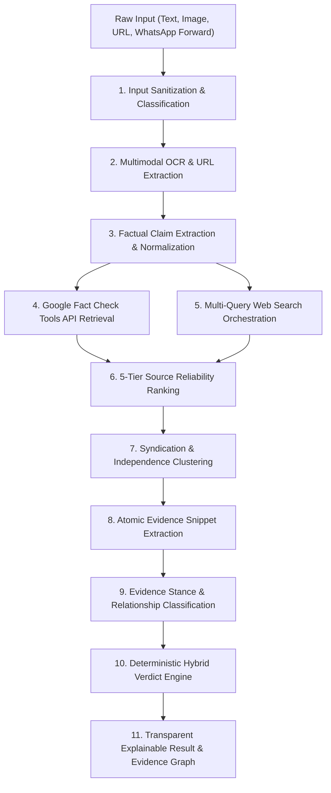

# SACHAI.AI — Verification Pipeline Specification

> **Fundamental Principle:** *AI does not decide what is true by itself. Evidence does.*

---

## Pipeline Overview

SACHAI.AI strictly separates natural language reasoning from deterministic truth aggregation. Instead of collapsing verification into a single `Claim -> LLM -> TRUE/FALSE` prompt, SACHAI.AI executes an 11-stage pipeline.



---

## Detailed Stages

### 1. Input Classification
Detects whether the input is `TEXT`, `IMAGE`, `SCREENSHOT`, `WHATSAPP_FORWARD`, `URL`, or `ARTICLE`.

### 2. OCR & Multimodal Vision
Uses PIL preprocessing and Gemini Multimodal Vision to extract embedded text from screenshots and separate statement claims from image context authenticity.

### 3. Claim Extraction & Decomposition
Isolates atomic factual claims and removes emotional rhetoric, clickbait hooks ("URGENT!", "Forward to 10 people"), and greetings. Canonical elements are structured as:
```json
{
  "subject": "UPI Transactions",
  "predicate": "ban / shutdown",
  "object": "nighttime transactions after 10 PM",
  "location": "India",
  "temporal_context": "Current"
}
```

### 4. Existing Fact-Check Retrieval
Queries the Google Fact Check Tools API (`claims.search`) to check if trusted fact-checking organizations have already audited the statement.

### 5. Multi-Query Web Search
Generates 4 targeted queries per claim:
- Exact claim keywords
- Neutral fact paraphrase
- Official / primary source query (e.g. `site:gov.in`, `site:rbi.org.in`)
- Fact-check query (`"fact check"`, `"clarification"`)

### 6. 5-Tier Source Reliability Ranking
- **Tier 1 (1.00 / 0.95)**: Primary Official records (Government, RBI, WHO, UN, Supreme Court, Nature, Science).
- **Tier 2 (0.85)**: Established Major News (Reuters, AP, BBC, The Hindu, PTI).
- **Tier 3 (0.85)**: Professional Fact-Checkers (AltNews, BoomLive, Snopes, PolitiFact).
- **Tier 4 (0.70 / 0.40)**: Known Secondary Publishers & General Websites.
- **Tier 5 (0.20 / 0.10)**: Social Media & Unknown Forums.

### 7. Source Independence & Syndication Deduplication
Calculates a `source_group_id` for wire copies so that 10 syndicated reproductions of a single report count as 1 independent source.

### 8. Atomic Evidence Extraction
Isolates verifiable paragraphs and evaluates freshness (`VERY_RECENT`, `RECENT`, `OLD`, `STALE`).

### 9. Evidence Stance Classification
Classifies the relationship between each piece of evidence and the claim into:
- `SUPPORTS`
- `CONTRADICTS`
- `PARTIALLY_SUPPORTS`
- `PARTIALLY_CONTRADICTS`
- `IRRELEVANT`
- `INSUFFICIENT`

### 10. Deterministic Hybrid Verdict Engine
Applies strict mathematical rules over evidence weights to produce:
- `TRUE`
- `FALSE`
- `MISLEADING`
- `PARTLY_TRUE`
- `UNVERIFIED`
- `OUTDATED`

Confidence is calculated as `HIGH`, `MEDIUM`, or `LOW` based on source tier scores, independent groups count, and agreement ratio.

### 11. Transparent Explanation & Graph
Synthesizes a clear summary ("Why this verdict?") and renders the Interactive Evidence Graph.
